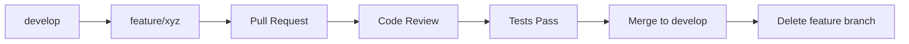
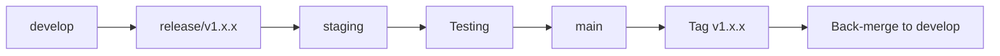

# 🌿 ATP System - Git Workflow Guide

> **Kompletny przewodnik po zarządzaniu branchami w projekcie ATP System**  
> Ostatnia aktualizacja: 26 maja 2025

## 🎯 Quick Start

### Nowa Funkcjonalność
```bash
git checkout develop
git pull origin develop
git checkout -b feature/nazwa-funkcjonalności
# ... praca nad kodem ...
git push origin feature/nazwa-funkcjonalności
# Utwórz Pull Request
```

### Naprawa Błędu
```bash
git checkout develop
git pull origin develop
git checkout -b fix/opis-błędu
# ... naprawa ...
git push origin fix/opis-błędu
# Utwórz Pull Request
```

### Pilna Naprawa Produkcyjna
```bash
git checkout main
git pull origin main
git checkout -b hotfix/krytyczny-błąd
# ... naprawa ...
git checkout main && git merge hotfix/krytyczny-błąd
git checkout develop && git merge hotfix/krytyczny-błąd
```

## 📋 Struktura Branchy

### Permanent Branches
- **`main`** - Produkcja (zawsze stabilny)
- **`develop`** - Integracja rozwoju
- **`staging`** - Pre-production testing

### Temporary Branches
- **`feature/*`** - Nowe funkcjonalności
- **`fix/*`** - Naprawy błędów
- **`hotfix/*`** - Pilne naprawy produkcyjne
- **`config/*`** - Konfiguracja
- **`docs/*`** - Dokumentacja
- **`test/*`** - Testowanie

## 🔄 Szczegółowe Procedury

### Feature Development Flow


### Release Flow


## 📝 Konwencje

### Branch Naming
- `feature/training-plan-management`
- `fix/session-timeout-error`
- `hotfix/security-vulnerability`
- `config/docker-setup`
- `docs/api-documentation`
- `test/e2e-validation`

### Commit Messages
```
type(scope): description

feat(auth): add multi-device session management
fix(api): resolve JWT refresh token issue
docs(readme): update installation guide
test(session): add comprehensive validation tests
chore(deps): update dependencies
```

## 🛡️ Protection Rules

### Main Branch
- Require pull request reviews (2 reviewers)
- Require status checks (tests, lint, build)
- Restrict pushes to main
- Require branches to be up to date

### Develop Branch
- Require pull request reviews (1 reviewer)
- Require status checks (tests, lint)
- Allow direct pushes for maintainers

## 🔧 Useful Commands

### Daily Workflow
```bash
# Start day - sync with remote
git fetch --all
git checkout develop
git pull origin develop

# Create feature branch
git checkout -b feature/my-feature

# Regular commits
git add .
git commit -m "feat(scope): descriptive message"
git push origin feature/my-feature

# Sync with develop (daily)
git checkout develop
git pull origin develop
git checkout feature/my-feature
git merge develop

# Finish feature
git push origin feature/my-feature
# Create Pull Request on GitHub
```

### Maintenance
```bash
# Clean up merged branches
git branch --merged | grep -v "\*\|main\|develop" | xargs -n 1 git branch -d

# Sync with remote (remove deleted branches)
git remote prune origin

# See branch relationships
git log --graph --oneline --all
```

## 📊 Branch Status Template

```markdown
## 🌿 Current Branches Status

### 🚀 Production (main)
- Version: v1.1.0
- Last deploy: 2025-05-26
- Status: ✅ Stable
- Features: Session Management (100% complete)

### 🔄 Development (develop)
- Status: 🔄 Active
- Next version: v1.2.0
- Features in progress: Training Plans System

### 🆕 Active Features
- `feature/training-plans` - @developer1
- `feature/analytics` - @developer2

### 🐛 Active Fixes
- `fix/deployment-issues` - @developer3

### 🧪 Testing
- `staging` - Ready for v1.2.0 testing
```

## 🎯 Best Practices Checklist

### Before Starting Work
- [ ] Sync with remote (`git fetch --all`)
- [ ] Start from develop branch
- [ ] Use descriptive branch names
- [ ] Check if similar branch exists

### During Development
- [ ] Commit frequently with good messages
- [ ] Push regularly to backup work
- [ ] Sync with develop weekly
- [ ] Write/update tests

### Before Pull Request
- [ ] Run all tests (`pnpm test`)
- [ ] Run linting (`pnpm lint`)
- [ ] Build successfully (`pnpm build`)
- [ ] Update documentation
- [ ] Squash commits if needed

### Pull Request
- [ ] Descriptive title and description
- [ ] Link to issues/tickets
- [ ] Add reviewers
- [ ] Add labels
- [ ] Ensure CI passes

### After Merge
- [ ] Delete feature branch
- [ ] Update local develop
- [ ] Update project boards/tracking

## 🚨 Emergency Procedures

### Hotfix for Production
```bash
# 1. Create hotfix from main
git checkout main
git pull origin main
git checkout -b hotfix/critical-fix

# 2. Make minimal fix
# ... fix code ...
git commit -m "hotfix: resolve critical issue"

# 3. Deploy immediately
git checkout main
git merge hotfix/critical-fix
git tag v1.1.1
git push origin main --tags

# 4. Back-merge to develop
git checkout develop
git merge main
git push origin develop

# 5. Clean up
git branch -d hotfix/critical-fix
git push origin --delete hotfix/critical-fix
```

### Rollback Production
```bash
# 1. Identify last good commit
git log --oneline main

# 2. Create rollback branch
git checkout main
git checkout -b rollback/to-v1.0.9

# 3. Reset to good commit
git reset --hard <good-commit-hash>

# 4. Force push (DANGEROUS - confirm with team)
git push origin rollback/to-v1.0.9
# Then merge via Pull Request
```

## 📚 Resources

- [Git Flow Documentation](https://nvie.com/posts/a-successful-git-branching-model/)
- [GitHub Flow](https://guides.github.com/introduction/flow/)
- [Conventional Commits](https://www.conventionalcommits.org/)
- [ATP System Developer Guide](./DEVELOPER_GUIDE.md)

---

*Ostatnia aktualizacja: 26 maja 2025*  
*Wersja: 1.0.0*
