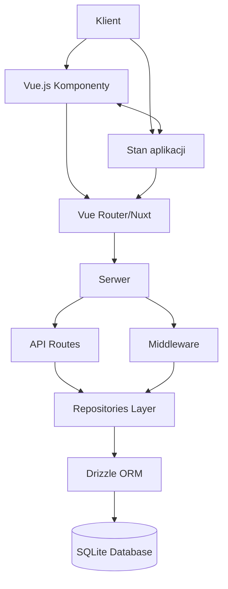

# Architektura systemu

::alert{type="info"}
ATP System to zaawansowana aplikacja pełnostackowa zbudowana na Nuxt.js 3, łącząca rendering po stronie serwera (SSR) z renderowaniem po stronie klienta.
::

## 🏗️ Ogólna architektura

System ATP został zbudowany w oparciu o następujące technologie:

::list{type="success"}
- **Frontend**: Vue.js 3 + Nuxt.js 3.17.4+
- **Backend**: Nitro Server (zintegrowany z Nuxt.js)
- **Baza danych**: Cloudflare D1 (produkcja) / SQLite (development) z Drizzle ORM
- **Deployment**: NuxtHub (Cloudflare Pages + D1 + R2)
- **Stylowanie**: Tailwind CSS + Nuxt UI
- **Zarządzanie zawartością**: Nuxt Content v3
::

### Diagram architektury



## 🧩 Główne komponenty systemu

::card{icon="i-heroicons-cube"}
#title
Nuxt.js Framework
#description
Nuxt.js zapewnia strukturę aplikacji, routing, middleware i integrację serwera:

- **app/** - Zawiera główny kod aplikacji
- **server/** - Kod uruchamiany na serwerze
- **public/** - Statyczne zasoby
- **content/** - Treści zarządzane przez Nuxt Content
::

::card{icon="i-heroicons-shield-check"}
#title
System uwierzytelniania JWT z automatycznym wylogowaniem
#description
Zaawansowany system uwierzytelniania oparty na tokenach JWT z automatycznym odnawianiem i wylogowaniem:

- **JWT Access Tokeny** - krótkotrwałe tokeny (15 min) do autoryzacji API
- **JWT Refresh Tokeny** - długotrwałe tokeny (30 dni) w HTTPOnly cookies
- **Automatyczne odnawianie** - tokeny odnawiane 2 min przed wygaśnięciem
- **Automatyczne wylogowanie** - przy błędach refresh tokena (401 responses)
- **Middleware autoryzacji** (`app/middleware/auth.ts`) - sprawdza uprawnienia użytkownika  
- **Middleware JWT** (`server/middleware/01.jwt-auth.ts`) - weryfikuje tokeny JWT
- **Composables** (`useJWTAuth`, `useAuth`) - zarządzanie tokenami i sesjami
- **Bezpieczne przechowywanie** - HTTPOnly cookies + session storage
::

::card{icon="i-heroicons-user-group"}
#title
System ról i uprawnień
#description
Wielopoziomowy system kontroli dostępu:

- **Role użytkowników** - ADMIN, MANAGER, COACH, EDITOR, ATHLETE, USER, OBSERVER
- **Granularne uprawnienia** - ponad 40 różnych uprawnień podzielonych na kategorie
- **Mapowanie uprawnień do API** - powiązanie endpointów API z wymaganymi uprawnieniami
- **Cache'owanie uprawnień** - optymalizacja wydajności przez przechowywanie uprawnień w lokalnym magazynie
::

::card{icon="i-heroicons-server"}
#title
Warstwa API
#description
Serwer Nitro obsługuje endpointy API w katalogu api:

- **Automatyczne mapowanie URL** - pliki organizowane jako `[resource]/[action].[method].ts`
- **Obsługa różnych metod HTTP** - GET, POST, PUT, DELETE itp.
- **Standardowy format odpowiedzi** - ujednolicona struktura odpowiedzi API
::

::card{icon="i-heroicons-database"}
#title
Warstwa bazy danych
#description
System używa Cloudflare D1 w produkcji i lokalnego SQLite w development z Drizzle ORM jako warstwą abstrakcji:

- **Produkcja**: Cloudflare D1 (serverless SQLite) przez NuxtHub
- **Development**: Lokalna baza SQLite
- **Schema**: Definicje tabel i relacji w schema.ts
- **Repozytoria**: Enkapsulacja logiki dostępu do danych w repositories
- **Migracje**: Obsługa zmian schematu bazy danych przez Drizzle Kit
- **ORM**: Drizzle ORM zapewnia type-safe queries i automatyczne typy TypeScript
::

::card{icon="i-heroicons-puzzle-piece"}
#title
Komponenty UI
#description
Interfejs użytkownika jest zbudowany przy użyciu Tailwind CSS i zorganizowany w modułowe komponenty:

- **Layouts** - Układy stron (dashboard, public)
- **Components** - Wielokrotnego użytku komponenty UI
- **Pages** - Poszczególne strony aplikacji
::

## 🔄 Przepływ danych

::tabs
#tab{name="Przepływ żądania HTTP" icon="i-heroicons-arrow-path"}
1. Żądanie trafia do Nuxt.js
2. Nuxt.js kieruje żądanie do odpowiedniej ścieżki (API lub strona)
3. Middleware sprawdza uwierzytelnienie i uprawnienia
4. W przypadku API:
   - Endpoint API przetwarza żądanie
   - Używa repozytoriów do operacji na bazie danych
   - Zwraca odpowiedź
5. W przypadku strony:
   - Komponenty Vue są renderowane
   - Dane są pobierane za pomocą composables
   - Strona jest zwracana do klienta

#tab{name="Przepływ uwierzytelniania JWT" icon="i-heroicons-key"}
1. Użytkownik loguje się, przekazując poświadczenia (`email` + `password`)
2. Serwer weryfikuje poświadczenia i generuje parę tokenów JWT:
   - **Access token** (15 min) - do autoryzacji API calls
   - **Refresh token** (30 dni) - w HTTPOnly cookie
3. Frontend automatycznie zarządza tokenami:
   - Access token w session storage
   - Automatyczne odnawianie 2 min przed wygaśnięciem
4. Middleware JWT weryfikuje access tokeny dla każdego API request
5. System uprawnień sprawdza czy użytkownik ma dostęp do zasobu
6. **Automatyczne wylogowanie** przy błędach refresh tokena (401)

#tab{name="Automatyczne wylogowanie" icon="i-heroicons-arrow-right-on-rectangle"}
1. Access token wygasa po 15 minutach
2. System automatycznie próbuje odnowić token za pomocą refresh tokena
3. Jeśli refresh token jest nieprawidłowy (401 response):
   - Callback `onRefreshError` jest wywołany
   - Wszystkie tokeny są czyszczone z session storage
   - Sesja użytkownika jest usuwana
   - Powiadomienie "Session Expired" jest wyświetlane
   - Przekierowanie na stronę logowania
4. Proces jest całkowicie automatyczny i bezobsługowy
::

## 🔗 Komunikacja między komponentami

### Zarządzanie stanem

System wykorzystuje `useState` z Nuxt.js do zarządzania stanem aplikacji:

```ts
// Definicja stanu
const users = useState<UserResource[]>('users', () => [])

// Aktualizacja stanu
users.value = [...newUsers]

// Odczytanie stanu w innym komponencie
const users = useState<UserResource[]>('users')
```

### Composables

Reużywalne funkcje (composables) enkapsulują logikę biznesową i dostęp do API:

```ts
// Definicja composable
export function useUsersApi() {
  // Stan, metody, etc.
  return { /* API */ }
}

// Użycie w komponencie
const { users, fetchUsers } = useUsersApi()
```

## ⚡ Optymalizacja wydajności

::callout{type="tip"}
System ATP stosuje szereg technik optymalizacji wydajności:
::

::list{type="success"}
- **Cache'owanie uprawnień użytkownika** - Uprawnienia są obliczane raz i przechowywane lokalnie
- **Lazy loading komponentów** - Komponenty są ładowane tylko wtedy, gdy są potrzebne
- **Selektywne pobieranie danych** - API pobiera tylko niezbędne dane
- **Strategie renderowania** - Wykorzystanie optymalnych strategii renderowania dla różnych stron
- **Cloudflare CDN** - Globalna dystrybucja treści przez sieć Cloudflare
- **Edge Computing** - Serwer Nitro uruchamiany na edge'u Cloudflare
- **Database Connection Pooling** - Optymalizacja połączeń z bazą D1
::

## 🚀 Deployment i infrastruktura

::card{icon="i-simple-icons-cloudflare"}
#title
NuxtHub + Cloudflare Stack
#description
System jest wdrażany w pełni na infrastrukturze Cloudflare:

- **Cloudflare Pages** - Hosting dla aplikacji Nuxt.js z SSR
- **Cloudflare D1** - Serverless SQLite database w edge locations
- **Cloudflare R2** - Object storage dla plików i media
- **Cloudflare KV** - Key-Value store dla cache i session storage
- **Cloudflare Workers** - Runtime dla Nitro server na edge
- **Automatyczne deployments** - CI/CD przez GitHub integration
::

## 🔐 Zarządzanie sesjami

::card{icon="i-heroicons-device-phone-mobile"}
#title
Multi-Device Session Management
#description
Zaawansowany system zarządzania sesjami z obsługą wielu urządzeń:

- **Device Recognition** - Automatyczne rozpoznawanie typu urządzenia i przeglądarki
- **IP Tracking** - Zapisywanie adresów IP dla celów bezpieczeństwa
- **Session Isolation** - Każde urządzenie ma osobną sesję
- **Remote Logout** - Możliwość zdalnego wylogowania z innych urządzeń
- **Session Monitoring** - Podgląd aktywnych sesji w dashboard
- **Security Alerts** - Powiadomienia o podejrzanej aktywności
::

## 🌐 Środowiska

System obsługuje różne środowiska z automatyczną konfiguracją przez NuxtHub:

::code-group
```bash [.env.development]
NODE_ENV=development
NUXT_SESSION_PASSWORD=your-development-secret
# Lokalna baza SQLite w .data/hub/db.sqlite
```

```bash [.env.staging]
NODE_ENV=staging
# Cloudflare D1 database (staging)
# Automatic configuration via NuxtHub
```

```bash [.env.production]
NODE_ENV=production
# Cloudflare D1 database (production) 
# Cloudflare R2 storage
# Cloudflare KV cache
# Full NuxtHub stack
```
::

## 🔧 Rozszerzalność

::alert{type="success"}
Architektura systemu została zaprojektowana z myślą o rozszerzalności i skalowaniu w chmurze!
::

1. **Modułowa struktura** - Łatwe dodawanie nowych funkcji przez composables i komponenty
2. **System uprawnień** - Proste dodawanie nowych uprawnień i ról
3. **Serverless architecture** - Automatyczne skalowanie przez Cloudflare infrastructure
4. **Edge computing** - Niska latencja dzięki globalnej sieci Cloudflare
5. **Type-safe development** - TypeScript end-to-end dla lepszej maintainability
6. **Database migrations** - Bezpieczne zmiany schematu przez Drizzle Kit
7. **Multi-region deployment** - Możliwość deployment w różnych regionach Cloudflare
8. **Incremental Static Regeneration** - Optymalizacja wydajności dla treści statycznych