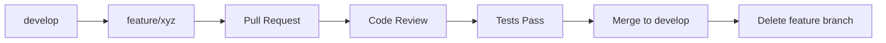
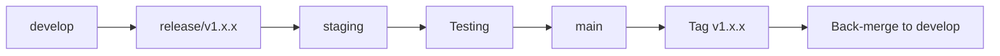

# Git Workflow & Branching Strategy

::alert{type="info"}
Przewodnik po profesjonalnym zarządzaniu branchami i workflow Git w projekcie ATP System. Wszystkie procedury są zoptymalizowane dla pracy zespołowej i CI/CD.
::

## 🎯 Quick Start

### Najczęściej używane komendy

::code-group
```bash [Nowa funkcjonalność]
git checkout develop
git pull origin develop
git checkout -b feature/nazwa-funkcjonalności
# ... praca nad kodem ...
git push origin feature/nazwa-funkcjonalności
# Utwórz Pull Request
```

```bash [Naprawa błędu]
git checkout develop
git pull origin develop
git checkout -b fix/opis-błędu
# ... naprawa ...
git push origin fix/opis-błędu
# Utwórz Pull Request
```

```bash [Pilna naprawa]
git checkout main
git pull origin main
git checkout -b hotfix/krytyczny-błąd
# ... naprawa ...
git checkout main && git merge hotfix/krytyczny-błąd
git checkout develop && git merge hotfix/krytyczny-błąd
```
::

## 🌿 Struktura Branchy

### Permanent Branches (Stałe)

::card{icon="i-heroicons-shield-check"}
#title
main
#description
**Produkcja** - Zawsze stabilny kod ready do deployment
- Status: ✅ Zawsze funkcjonalny
- Protection: Wymaga 2 reviewerów + CI tests
- Deploy: Automatyczny na produkcję
::

::card{icon="i-heroicons-arrow-path"}
#title
develop
#description
**Rozwój** - Integracja nowych funkcji przed release
- Status: 🔄 Aktywny development
- Protection: Wymaga 1 reviewera + CI tests
- Deploy: Automatyczny na staging
::

::card{icon="i-heroicons-beaker"}
#title
staging
#description
**Testowanie** - Pre-production testing environment
- Status: 🧪 Ready for testing
- Protection: Merge z develop po testach
- Deploy: Ręczny trigger na staging environment
::

### Temporary Branches (Tymczasowe)

::tabs
#tab{name="feature/*" icon="i-heroicons-plus"}
**Nowe funkcjonalności**

```bash
feature/training-plan-management
feature/analytics-dashboard
feature/user-profiles
feature/mobile-app
feature/notification-system
```

- **Źródło**: `develop`
- **Merge do**: `develop`
- **Lifetime**: 1-4 tygodnie
- **Naming**: `feature/descriptive-name`

#tab{name="fix/*" icon="i-heroicons-wrench-screwdriver"}
**Naprawy błędów**

```bash
fix/auth-session-timeout
fix/database-connection
fix/ui-responsive-issues
fix/deployment-optimization
```

- **Źródło**: `develop`
- **Merge do**: `develop`
- **Lifetime**: 1-7 dni
- **Naming**: `fix/issue-description`

#tab{name="hotfix/*" icon="i-heroicons-exclamation-triangle"}
**Pilne naprawy produkcyjne**

```bash
hotfix/security-vulnerability
hotfix/critical-bug-fix
hotfix/performance-issue
```

- **Źródło**: `main`
- **Merge do**: `main` + `develop`
- **Lifetime**: Kilka godzin
- **Naming**: `hotfix/critical-issue`

#tab{name="config/*" icon="i-heroicons-cog-6-tooth"}
**Konfiguracja i setup**

```bash
config/ci-cd-pipeline
config/docker-setup
config/environment-vars
config/cloudflare-workers
```

- **Źródło**: `develop`
- **Merge do**: `develop`
- **Lifetime**: 1-2 tygodnie
- **Naming**: `config/setup-name`

#tab{name="docs/*" icon="i-heroicons-document-text"}
**Dokumentacja**

```bash
docs/api-documentation
docs/user-guide
docs/architecture-diagrams
docs/git-workflow
```

- **Źródło**: `develop`
- **Merge do**: `develop`
- **Lifetime**: 1-7 dni
- **Naming**: `docs/documentation-type`

#tab{name="test/*" icon="i-heroicons-beaker"}
**Testowanie i QA**

```bash
test/e2e-automation
test/performance
test/security-audit
test/session-management-validation
```

- **Źródło**: `develop`
- **Merge do**: `develop`
- **Lifetime**: 1-2 tygodnie
- **Naming**: `test/test-type`
::

## 🔄 Git Flow Workflow

### 1. Feature Development Flow



::code-group
```bash [1. Rozpoczęcie]
# Synchronizacja z remote
git checkout develop
git pull origin develop

# Utworzenie feature branch
git checkout -b feature/training-system
```

```bash [2. Development]
# Regularne commity
git add .
git commit -m "feat(training): add training plan model"

# Push dla backup
git push origin feature/training-system

# Sync z develop (co kilka dni)
git checkout develop
git pull origin develop
git checkout feature/training-system
git merge develop
```

```bash [3. Finalizacja]
# Testy i cleanup
pnpm run test
pnpm run lint
pnpm run build

# Ostatni commit
git add .
git commit -m "feat(training): complete implementation"
git push origin feature/training-system

# Pull Request
gh pr create --base develop --head feature/training-system
```
::

### 2. Release Process



::code-group
```bash [1. Przygotowanie Release]
# Merge features do develop
git checkout develop
git merge feature/training-system
git branch -d feature/training-system

# Release branch
git checkout -b release/v1.2.0
```

```bash [2. Testing na Staging]
# Deploy na staging
git checkout staging
git merge release/v1.2.0

# Testy i poprawki w release branch
git checkout release/v1.2.0
git commit -m "chore: prepare v1.2.0 release"
```

```bash [3. Production Deploy]
# Merge do main
git checkout main
git merge release/v1.2.0
git tag v1.2.0
git push origin main --tags

# Back-merge do develop
git checkout develop
git merge main
```
::

### 3. Hotfix Process

::callout{type="warning"}
Hotfixy to pilne naprawy produkcyjne. Używaj tylko w przypadku krytycznych błędów!
::

```bash
# 1. Hotfix z main
git checkout main
git pull origin main
git checkout -b hotfix/critical-security-fix

# 2. Szybka naprawa
git commit -m "hotfix: resolve security vulnerability"

# 3. Merge do main i develop
git checkout main
git merge hotfix/critical-security-fix
git tag v1.2.1

git checkout develop
git merge hotfix/critical-security-fix

# 4. Cleanup
git branch -d hotfix/critical-security-fix
```

## 📝 Konwencje Nazewnictwa

### Branch Naming Conventions

::alert{type="success"}
Używaj opisowych nazw branchy zgodnych z konwencją `type/descriptive-name`
::

::code-group
```bash [✅ Dobre nazwy]
feature/user-session-management
feature/training-plan-builder
fix/jwt-token-expiration
fix/responsive-mobile-layout
hotfix/security-vulnerability-patch
config/cloudflare-deployment
docs/api-endpoint-documentation
test/session-management-validation
```

```bash [❌ Złe nazwy]
feature/stuff
fix/bug
test/testing
docs/update
my-feature
bugfix
temp
```
::

### Commit Message Convention

**Format**: `type(scope): description`

::tabs
#tab{name="Types" icon="i-heroicons-tag"}
- `feat` - Nowa funkcjonalność
- `fix` - Naprawa błędu
- `docs` - Dokumentacja
- `style` - Formatowanie (nie wpływa na kod)
- `refactor` - Refaktoryzacja kodu
- `test` - Dodanie lub modyfikacja testów
- `chore` - Zmiany w build procesie lub narzędziach

#tab{name="Scopes" icon="i-heroicons-folder"}
- `auth` - System autoryzacji
- `api` - API endpoints
- `ui` - Interfejs użytkownika
- `db` - Baza danych
- `config` - Konfiguracja
- `deps` - Dependencies

#tab{name="Examples" icon="i-heroicons-chat-bubble-left-ellipsis"}
```bash
feat(auth): implement multi-device session management
fix(api): resolve JWT token refresh endpoint error
docs(readme): update installation instructions
test(session): add comprehensive validation tests
chore(deps): update dependencies to latest versions
style(ui): improve responsive layout formatting
refactor(db): optimize query performance
```
::

## 🛡️ Branch Protection Rules

### Main Branch Protection

::code-group
```yaml [GitHub Settings]
require_status_checks: true
require_branches_to_be_up_to_date: true
required_status_check_contexts:
  - "ci/tests"
  - "ci/lint"
  - "ci/build"
  - "ci/security-scan"
restrict_pushes: true
required_pull_request_reviews:
  required_approving_review_count: 2
  dismiss_stale_reviews: true
  require_code_owner_reviews: true
enforce_admins: true
```

```json [Branch Rules]
{
  "protection": {
    "required_status_checks": {
      "strict": true,
      "contexts": ["ci/tests", "ci/lint", "ci/build"]
    },
    "required_pull_request_reviews": {
      "required_approving_review_count": 2,
      "dismiss_stale_reviews": true
    },
    "restrictions": {
      "users": [],
      "teams": ["core-developers"]
    }
  }
}
```
::

### Develop Branch Protection

```yaml
require_status_checks: true
required_status_check_contexts:
  - "ci/tests"
  - "ci/lint"
required_pull_request_reviews:
  required_approving_review_count: 1
allow_force_pushes: false
```

## 🔧 Useful Git Commands

### Daily Workflow

::code-group
```bash [Branch Management]
# Lista wszystkich branchy
git branch -a

# Lista remote branchy
git branch -r

# Usuń local branch
git branch -d feature/nazwa

# Usuń remote branch
git push origin --delete feature/nazwa

# Przejdź na poprzedni branch
git checkout -

# Zobacz historię graficznie
git log --graph --oneline --all
```

```bash [Synchronizacja]
# Pobierz wszystkie zmiany
git fetch --all

# Sync local z remote
git remote prune origin

# Reset branch do remote
git reset --hard origin/branch-name

# Merge vs Rebase
git merge develop        # Zachowuje historię
git rebase develop       # Liniowa historia
```

```bash [Maintenance]
# Cleanup merged branches
git branch --merged | grep -v "\*\|main\|develop" | xargs -n 1 git branch -d

# Prune remote branches
git remote prune origin

# Interactive rebase
git rebase -i HEAD~3

# Cherry-pick commit
git cherry-pick <commit-hash>
```
::

### Git Aliases

Dodaj do `~/.gitconfig` dla szybszej pracy:

```ini
[alias]
    co = checkout
    br = branch
    ci = commit
    st = status
    unstage = reset HEAD --
    last = log -1 HEAD
    visual = !gitk
    graph = log --graph --oneline --all
    cleanup = "!git branch --merged | grep -v '\\*\\|main\\|develop' | xargs -n 1 git branch -d"
    pushf = push --force-with-lease
    amend = commit --amend --no-edit
```

## 📊 Branch Status Dashboard

### Current Active Branches

::card{icon="i-heroicons-rocket-launch"}
#title
🚀 Production (main)
#description
- **Status**: ✅ Stable
- **Version**: v1.1.0
- **Last deploy**: 2025-05-26
- **Features**: Session Management System (100% complete)
- **Next release**: v1.2.0 (Training System)
::

::card{icon="i-heroicons-arrow-path"}
#title
🔄 Development (develop)
#description
- **Status**: 🔄 Active development
- **Last update**: 2025-05-26
- **Next features**: Training Plans System
- **Tests**: ✅ 19/19 passed (Session Management)
- **Ready for**: Training system implementation
::

::card{icon="i-heroicons-beaker"}
#title
🧪 Staging (staging)
#description
- **Status**: 🧪 Ready for v1.2.0 testing
- **Last deploy**: 2025-05-25
- **Testing**: Pre-production validation
- **Environment**: https://staging.atp-system.pl
::

### Active Feature Branches

::list{type="info"}
- `feature/training-plans` - Training management system (@developer1)
- `feature/analytics-dashboard` - Performance analytics (@developer2)
- `feature/mobile-responsive` - Mobile optimization (@developer3)
- `feature/notification-system` - Real-time notifications (@developer4)
::

### Active Fix Branches

::list{type="warning"}
- `fix/deployment-optimization` - Build process improvements
- `fix/database-performance` - Query optimization
- `fix/ui-accessibility` - WCAG compliance fixes
::

### Recently Completed

::list{type="success"}
- ✅ `feature/session-management` - Multi-device session control (merged)
- ✅ `fix/jwt-token-refresh` - Token refresh mechanism (merged)
- ✅ `docs/developer-guide` - Complete developer documentation (merged)
- ✅ `config/git-workflow` - Git branching strategy setup (merged)
::

## 🎯 Best Practices

### Do's ✅

::list{type="success"}
- Używaj opisowych nazw branchy
- Commit często z dobrymi wiadomościami
- Testuj przed każdym merge
- Aktualizuj branch z develop regularnie
- Usuwaj branche po merge
- Używaj Pull Requests dla review
- Squash commits przed merge (jeśli potrzebne)
- Sync z remote przed rozpoczęciem pracy
::

### Don'ts ❌

::list{type="error"}
- Nie commituj bezpośrednio do main
- Nie używaj skrótów w nazwach branchy
- Nie pozostawiaj długo żyjących feature branchy
- Nie merge bez testów i review
- Nie force push do shared branchy
- Nie commituj secrets lub credentials
- Nie ignoruj konfliktów merge
- Nie rebase public/shared branchy
::

## 🚨 Emergency Procedures

### Rollback Production

::callout{type="error"}
Procedura rollback dla krytycznych problemów na produkcji
::

```bash
# 1. Identify last good commit
git log --oneline main

# 2. Create rollback branch
git checkout main
git checkout -b rollback/to-v1.0.9

# 3. Reset to good commit
git reset --hard <good-commit-hash>

# 4. Create PR for rollback (TEAM CONFIRMATION REQUIRED)
gh pr create --base main --head rollback/to-v1.0.9 \
  --title "EMERGENCY ROLLBACK: Revert to v1.0.9" \
  --body "Critical rollback due to production issue"
```

### Conflict Resolution

```bash
# 1. Update your branch
git checkout feature/your-branch
git fetch origin
git merge origin/develop

# 2. Resolve conflicts manually
# Edit conflicted files

# 3. Mark as resolved
git add .
git commit -m "resolve: merge conflicts with develop"

# 4. Push resolved version
git push origin feature/your-branch
```

## 📚 Resources & Training

### Official Documentation
- [Git Documentation](https://git-scm.com/doc)
- [GitHub Flow](https://guides.github.com/introduction/flow/)
- [Conventional Commits](https://www.conventionalcommits.org/)

### ATP System Specific
- [Developer Guide](./developer-guide.md) - Complete development procedures
- [Architecture](./architektura.md) - System architecture overview
- [API Documentation](./api.md) - API endpoints and usage

### Tools & Extensions
- **Git GUI**: GitKraken, SourceTree, GitHub Desktop
- **VS Code Extensions**: GitLens, Git Graph, GitHub Pull Requests
- **Command Line**: GitHub CLI (`gh`), Git aliases

---

::alert{type="success"}
**Status**: Git workflow jest w pełni skonfigurowany i gotowy do użycia w projekcie ATP System. Wszystkie procedury są zoptymalizowane dla pracy zespołowej i zapewniają wysoką jakość kodu.
::
