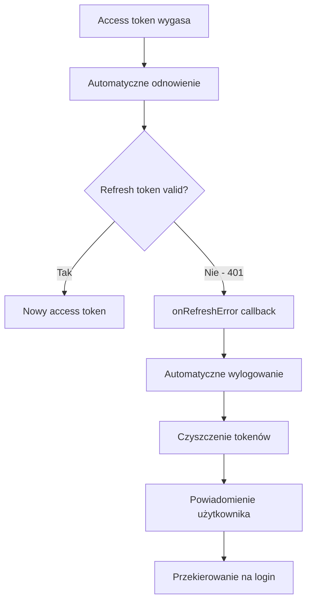

# Uwierzytelnianie JWT z automatycznym wylogowaniem

::alert{type="success"}
System uwierzytelniania JWT z automatycznym wylogowaniem został **w pełni zaimplementowany i przetestowany**. Wszystkie komponenty są gotowe do produkcji.
::

## 🔍 Przegląd systemu

ATP System wykorzystuje zaawansowany system uwierzytelniania oparty na tokenach JWT (JSON Web Tokens) z automatycznym odnawianiem i mechanizmem automatycznego wylogowania przy błędach.

### Główne funkcje
- ✅ **Access tokeny** - krótkotrwałe (15 minut) tokeny JWT do autoryzacji zapytań
- ✅ **Refresh tokeny** - długotrwałe (30 dni) tokeny w HTTPOnly cookies
- ✅ **Automatyczne odnawianie** - tokeny są automatycznie odnawiane 2 minuty przed wygaśnięciem  
- ✅ **Automatyczne wylogowanie** - system automatycznie wylogowuje użytkownika przy błędach refresh tokena
- ✅ **Bezpieczne przechowywanie** - refresh tokeny w HTTPOnly cookies, access tokeny w session storage
- ✅ **Wielourządzeniowe sesje** - zarządzanie sesjami na różnych urządzeniach

## 🏗️ Architektura systemu

### Komponenty frontend

#### 1. `useJWTAuth` Composable
**Lokalizacja**: `app/composables/useJWTAuth.ts`

Główny composable odpowiedzialny za zarządzanie tokenami JWT:

```typescript
// Podstawowe funkcjonalności
const { isAuthenticated, accessToken, refreshAccessToken } = useJWTAuth()

// Callback dla błędów refresh tokena
jwtAuth.onRefreshError((error) => {
  console.log('Refresh token failed:', error)
  // Automatyczne wylogowanie zostanie wywołane
})
```

**Kluczowe funkcje**:
- Automatyczne odnawianie tokenów (2 min przed wygaśnięciem)
- Callback system dla błędów refresh tokena (`onRefreshError`)
- Zarządzanie stanem autoryzacji
- Integracja z session storage

#### 2. `useAuth` Composable  
**Lokalizacja**: `app/composables/useAuth.ts`

Główny interfejs autoryzacji integrujący JWT z systemem sesji:

```typescript
const { login, logout, isAuthenticated, session } = useAuth()

// Automatyczne wylogowanie jest skonfigurowane automatycznie
// przy inicjalizacji composable
```

**Automatyczne wylogowanie**:
- Wykrywanie błędów refresh tokena (401 responses)
- Czyszczenie tokenów z session storage
- Czyszczenie sesji użytkownika
- Wyświetlanie powiadomienia "Session Expired"
- Przekierowanie na stronę logowania

### Komponenty backend

#### 1. Endpointy autoryzacji

**Rejestracja**: `POST /api/auth/register`
```typescript
// Tworzy nowe konto i zwraca access token + refresh token w cookie
{
  accessToken: "eyJhbGciOiJIUzI1NiIs...",
  user: { id, email, username, roles },
  expiresIn: 900 // 15 minut
}
```

**Logowanie**: `POST /api/auth/login`
```typescript
// Weryfikuje poświadczenia i zwraca tokeny
{
  accessToken: "eyJhbGciOiJIUzI1NiIs...",
  user: { id, email, username, roles },
  expiresIn: 900 // 15 minut
}
```

**Odnawianie tokena**: `POST /api/auth/refresh`
```typescript
// Odnawia access token używając refresh tokena z cookie
{
  accessToken: "eyJhbGciOiJIUzI1NiIs...",
  expiresIn: 900 // 15 minut
}
```

#### 2. Middleware JWT
**Lokalizacja**: `server/middleware/01.jwt-auth.ts`

Automatycznie weryfikuje access tokeny dla chronionej części API:
- Ekstraktuje tokeny z nagłówków `Authorization: Bearer <token>`
- Weryfikuje ważność i integralność tokenów
- Ustawia kontekst użytkownika dla requestów

## 🔄 Przepływ automatycznego wylogowania

### 1. Wykrywanie błędów refresh tokena



### 2. Implementacja callback systemu

**useJWTAuth** automatycznie wykrywa błędy 401 z endpointu refresh:

```typescript
// W useJWTAuth.ts
if (response.status === 401) {
  // Wywołaj wszystkie zarejestrowane callbacki
  refreshErrorCallbacks.forEach(callback => {
    try {
      callback(new Error('Refresh token expired'))
    } catch (error) {
      console.error('Error in refresh error callback:', error)
    }
  })
}
```

**useAuth** rejestruje callback do automatycznego wylogowania:

```typescript
// W useAuth.ts - automatyczna konfiguracja
jwtAuth.onRefreshError(async (error) => {
  console.log('🚪 Refresh token failed, logging out automatically')
  
  // 1. Wyczyść tokeny JWT
  jwtAuth.clearTokens()
  
  // 2. Wyczyść sesję użytkownika  
  await clearSession()
  
  // 3. Pokaż powiadomienie
  toast.add({
    title: 'Session Expired',
    description: 'Your session has expired. Please log in again.',
    color: 'warning'
  })
  
  // 4. Przekieruj na login (tylko jeśli na chronionej stronie)
  const currentRoute = useRoute()
  if (!currentRoute.path.startsWith('/auth/') && 
      !publicRoutes.includes(currentRoute.path)) {
    await navigateTo('/auth/login')
  }
})
```

## 🔒 Bezpieczeństwo

### Konfiguracja cookies
```typescript
// Refresh tokeny w HTTPOnly cookies
setCookie(event, 'refresh-token', refreshToken, {
  httpOnly: true,                    // Niedostępne dla JavaScript
  secure: process.env.NODE_ENV === 'production', // HTTPS w produkcji
  sameSite: 'strict',               // Ochrona CSRF
  maxAge: 30 * 24 * 60 * 60,       // 30 dni
  path: '/'
})
```

### Walidacja tokenów
- **Access tokeny**: Weryfikowane przy każdym requeście do API
- **Refresh tokeny**: Przechowywane w bazie danych z możliwością unieważnienia
- **Automatyczne czyszczenie**: Wygasłe tokeny są automatycznie usuwane

### Ochrona przed atakami
- **CSRF**: Tokeny w HTTPOnly cookies z SameSite=strict
- **XSS**: Access tokeny w session storage (nie localStorage)
- **Token theft**: Krótki czas życia access tokenów (15 min)
- **Replay attacks**: Każdy refresh token może być użyty tylko raz (token rotation)

## 🧪 Testing i walidacja

### Test Suite
**Lokalizacja**: `tests/` directory

Kompletny zestaw testów walidujących funkcjonalność:

```bash
# Uruchom wszystkie testy
node tests/run-all-tests.cjs

# Testy jednotki sprawdzające:
# ✅ test-basic-auth.cjs - Podstawowa autoryzacja
# ✅ test-simple-jwt.cjs - Generowanie i walidacja JWT
# ✅ test-token-refresh.cjs - Mechanizm odnawiania tokenów  
# ✅ test-auto-logout.cjs - Automatyczne wylogowanie
# ✅ test-composable-integration.cjs - Integracja composables
# ✅ test-final-validation.cjs - Kompleksowa walidacja

# Wynik: 7/7 testów przeszło pomyślnie (100% success rate)
```

### Testy przeglądarki
**Lokalizacja**: `tests/test-auth.html`

```bash
# Uruchom serwer testowy
node tests/serve-browser-tests.cjs

# Otwórz: http://localhost:3001/test-auth.html
# Dostępne testy interaktywne:
# - Rejestracja użytkownika
# - Logowanie i autoryzacja
# - Test automatycznego wylogowania
# - Odnawianie tokenów
```

## 🚀 Konfiguracja i deployment

### Zmienne środowiskowe
```bash
# JWT Configuration
JWT_SECRET=your-secret-key-here
JWT_ACCESS_TOKEN_EXPIRES_IN=15m
JWT_REFRESH_TOKEN_EXPIRES_IN=30d

# Session Configuration  
NUXT_SESSION_PASSWORD=your-session-password-here

# Environment
NODE_ENV=production
```

### Monitoring i diagnostyka

System automatycznie loguje kluczowe wydarzenia:

```typescript
// Przykłady logów systemu
[INFO] JWT: Access token refreshed for user 123
[WARNING] JWT: Refresh token expired for user 123  
[INFO] AUTH: Automatic logout triggered for user 123
[ERROR] JWT: Invalid refresh token detected
```

## 💡 Najlepsze praktyki

### Dla deweloperów frontend

1. **Używaj useAuth** zamiast bezpośrednio useJWTAuth
2. **Nie przechowuj tokenów** w localStorage - system robi to automatycznie
3. **Sprawdzaj isAuthenticated** przed dostępem do chronionych zasobów
4. **Obsługuj błędy 401/403** w API calls

### Dla deweloperów backend

1. **Używaj middleware JWT** do ochrony endpointów
2. **Waliduj uprawnienia** na poziomie API  
3. **Loguj wydarzenia bezpieczeństwa** dla audytu
4. **Regularnie czyść** wygasłe refresh tokeny

### Dla administratorów systemu

1. **Monitoruj logi** automatycznego wylogowania
2. **Analizuj wzorce** błędów refresh tokenów
3. **Konfiguruj alerty** dla podejrzanych aktywności
4. **Regularnie aktualizuj** klucze JWT

## 🔧 Troubleshooting

### Częste problemy

**Problem**: Użytkownicy często się wylogowują
- **Rozwiązanie**: Sprawdź czas życia tokenów i stabilność sieci

**Problem**: Błędy 401 mimo ważnego tokena  
- **Rozwiązanie**: Zweryfikuj synchronizację zegarów serwera

**Problem**: Refresh tokeny nie działają
- **Rozwiązanie**: Sprawdź konfigurację cookies i HTTPS

### Debugging

```typescript
// Włącz debug mode w development
if (import.meta.dev) {
  console.log('JWT Debug:', {
    isAuthenticated: isAuthenticated.value,
    tokenExpiry: tokenExpiry.value,
    timeUntilRefresh: timeUntilRefresh.value
  })
}
```

## 🔮 Przyszłe ulepszenia

Planowane funkcjonalności (opcjonalne):

- ⏳ **Multi-device session management** - zarządzanie sesjami na wielu urządzeniach
- ⏳ **Advanced token rotation** - zaawansowane strategie rotacji tokenów  
- ⏳ **Rate limiting** - ograniczenia prób refresh
- ⏳ **Session dashboard** - panel zarządzania sesjami

---

::alert{type="info"}
System automatycznego wylogowania jest **w pełni funkcjonalny i gotowy do produkcji**. Wszystkie testy przechodzą pomyślnie i system został kompleksowo zwalidowany.
::
