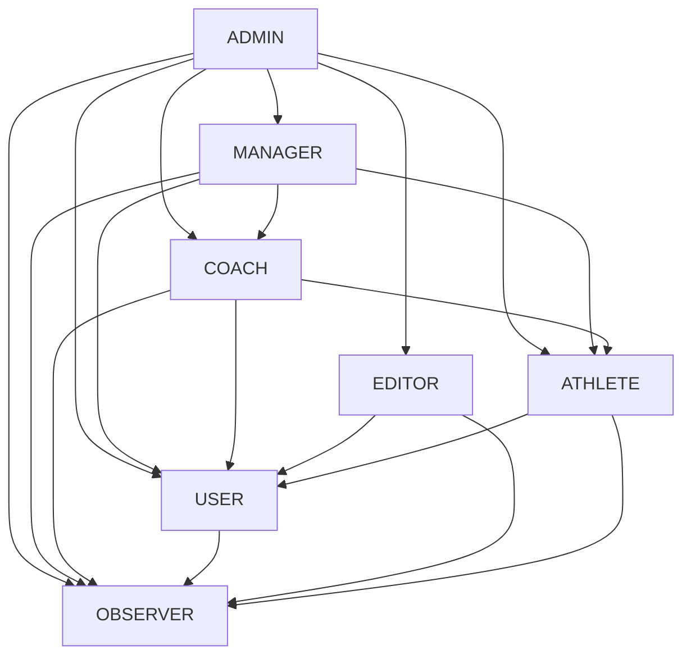

# Przewodnik po kontroli dostępu opartej na rolach (RBAC)

Kompleksowy przewodnik po implementacji i zarządzaniu kontrolą dostępu opartą na rolach w ATP System.

## 🎯 Przegląd

ATP System wykorzystuje hierarchiczny system kontroli dostępu oparty na rolach (RBAC), który zapewnia bezpieczne, skalowalne i elastyczne zarządzanie uprawnieniami we wszystkich komponentach systemu. System obsługuje **przypisania wielu ról**, gdzie użytkownicy mogą mieć wiele ról jednocześnie, z uprawnieniami agregowanymi ze wszystkich przypisanych ról.

---

## 🏗️ Architektura RBAC

### Hierarchia systemu


### Core Components

#### 1. Role System (UserRoleEnum)
```typescript
export enum UserRoleEnum {
  /**
   * Administrator systemu - pełen dostęp do wszystkich funkcji
   */
  ADMIN = 'admin',
  
  /**
   * Trener - może zarządzać programami treningowymi i podopiecznymi
   */
  COACH = 'coach',
  
  /**
   * Sportowiec - może przeglądać swoje programy treningowe i wyniki
   */
  ATHLETE = 'athlete',
  
  /**
   * Manager - zarządza aspektami organizacyjnymi, ale nie treningowymi
   */
  MANAGER = 'manager',
  
  /**
   * Editor - osoba mogąca dodawać i zarządzać treściami w systemie CMS
   */
  EDITOR = 'editor',
  
  /**
   * Użytkownik - osoba posiadająca konto w systemie z podstawowymi uprawnieniami
   */
  USER = 'user',
  
  /**
   * Obserwator - osoba mogąca jedynie przeglądać publicznie dostępne treści
   */
  OBSERVER = 'observer',
}
```

#### 2. System uprawnień (format resource:action)
```typescript
export const PERMISSIONS = {
  // ===== ZARZĄDZANIE UŻYTKOWNIKAMI =====
  USER_VIEW: 'user:view',
  USER_CREATE: 'user:create',
  USER_EDIT: 'user:edit',
  USER_DELETE: 'user:delete',
  USER_ASSIGN_ROLE: 'user:assign_role',
  PROFILE_VIEW: 'profile:view',

  // ===== PROGRAMY TRENINGOWE =====
  TRAINING_VIEW: 'training:view',
  TRAINING_VIEW_ALL: 'training:view:all',
  TRAINING_CREATE: 'training:create',
  TRAINING_EDIT: 'training:edit',
  TRAINING_DELETE: 'training:delete',
  TRAINING_ASSIGN: 'training:assign',
  TRAINING_ENROLL: 'training:enroll',

  // ===== WYNIKI I POSTĘPY =====
  PROGRESS_VIEW: 'progress:view',
  PROGRESS_VIEW_ALL: 'progress:view:all',
  PROGRESS_ADD: 'progress:add',
  PROGRESS_EDIT: 'progress:edit',
  PROGRESS_DELETE: 'progress:delete',

  // ===== ZARZĄDZANIE TREŚCIĄ =====
  CONTENT_VIEW: 'content:view',
  CONTENT_VIEW_PUBLIC: 'content:view:public',
  CONTENT_CREATE: 'content:create',
  CONTENT_EDIT: 'content:edit',
  CONTENT_DELETE: 'content:delete',
  CONTENT_PUBLISH: 'content:publish',
  
  // ... i inne uprawnienia
} as const;
```

#### 3. Hierarchia ról z wielodziedziczeniem
```typescript
export const ROLE_HIERARCHY: Record<RoleSlug, RoleSlugs> = {
  [USER_ROLES.ADMIN]: [
    USER_ROLES.MANAGER, 
    USER_ROLES.COACH, 
    USER_ROLES.ATHLETE, 
    USER_ROLES.USER, 
    USER_ROLES.OBSERVER, 
    USER_ROLES.EDITOR
  ],
  [USER_ROLES.MANAGER]: [
    USER_ROLES.COACH, 
    USER_ROLES.ATHLETE, 
    USER_ROLES.USER, 
    USER_ROLES.OBSERVER
  ],
  [USER_ROLES.COACH]: [
    USER_ROLES.ATHLETE, 
    USER_ROLES.USER, 
    USER_ROLES.OBSERVER
  ],
  [USER_ROLES.EDITOR]: [
    USER_ROLES.USER, 
    USER_ROLES.OBSERVER
  ],
  [USER_ROLES.ATHLETE]: [
    USER_ROLES.USER, 
    USER_ROLES.OBSERVER
  ],
  [USER_ROLES.USER]: [
    USER_ROLES.OBSERVER
  ],
  [USER_ROLES.OBSERVER]: []
};
```

---

## 🎭 Definicje ról

### ADMIN
**Najwyższy poziom uprawnień** - Pełna kontrola systemu

**Opis:** Administrator systemu z dostępem do wszystkich funkcji

**Uprawnienia:**
- **Wszystkie uprawnienia w systemie** (Object.values(PERMISSIONS))
- Zarządzanie użytkownikami i rolami
- Konfiguracja systemu
- Zarządzanie bezpieczeństwem
- Dostęp do bazy danych

**Przypadki użycia:**
- Konserwacja systemu
- Zarządzanie w sytuacjach awaryjnych
- Incydenty bezpieczeństwa
- Początkowa konfiguracja systemu

**Implementacja:**
```typescript
// Administrator ma wszystkie uprawnienia
[USER_ROLES.ADMIN]: Object.values(PERMISSIONS) as Permissions
```

### MANAGER
**Zarządzanie organizacyjne** - Nadzór nad zespołami

**Opis:** Zarządza aspektami organizacyjnymi, trenerami i sportowcami

**Uprawnienia:**
```typescript
const managerPermissions = [
  // Zarządzanie użytkownikami
  'user:view', 'user:create', 'user:edit',
  
  // Programy treningowe
  'training:view', 'training:view:all',
  'training:create', 'training:edit',
  
  // Wyniki i postępy
  'progress:view:all', 'progress:edit',
  
  // Treści
  'content:view', 'content:create', 'content:edit',
  
  // Harmonogram
  'schedule:view:all', 'schedule:create',
  'schedule:edit', 'schedule:delete',
  
  // Komunikacja
  'message:send', 'message:view', 'notification:send',
  
  // Statystyki i raporty
  'stats:view', 'stats:advanced', 'report:generate'
]
```

**Dziedziczenie:**
- Wszystkie uprawnienia COACH, ATHLETE, USER, OBSERVER

### COACH
**Zarządzanie treningami** - Trener sportowy

**Opis:** Może zarządzać programami treningowymi i podopiecznymi

**Uprawnienia:**
```typescript
const coachPermissions = [
  // Zarządzanie użytkownikami
  'user:view',
  
  // Programy treningowe
  'training:view', 'training:view:all',
  'training:create', 'training:edit', 'training:assign',
  
  // Wyniki i postępy
  'progress:view:all', 'progress:add', 'progress:edit',
  
  // Harmonogram
  'schedule:view', 'schedule:view:all',
  'schedule:create', 'schedule:edit',
  
  // Komunikacja
  'message:send', 'message:view', 'notification:send',
  
  // Statystyki
  'stats:view', 'report:generate'
]
```

**Ograniczenia zakresu:**
- Może zarządzać tylko przypisanymi sportowcami
- Nie może usuwać użytkowników
- Nie ma dostępu do konfiguracji systemu

### ATHLETE
**Sportowiec** - Uczestnik programów treningowych

**Opis:** Może przeglądać swoje programy treningowe i wyniki

**Uprawnienia:**
```typescript
const athletePermissions = [
  // Programy treningowe
  'training:view',
  
  // Wyniki i postępy
  'progress:view', 'progress:add',
  
  // Treści
  'content:view',
  
  // Harmonogram
  'schedule:view',
  
  // Komunikacja
  'message:send', 'message:view',
  
  // Statystyki
  'stats:view'
]
```

**Charakterystyka:**
- Dostęp tylko do własnych danych treningowych
- Może dodawać swoje wyniki
- Ograniczony dostęp do komunikacji

### EDITOR
**Redaktor treści** - Zarządzanie contentem

**Opis:** Osoba mogąca dodawać i zarządzać treściami w systemie CMS

**Uprawnienia:**
```typescript
const editorPermissions = [
  // Treści
  'content:view', 'content:create',
  'content:edit', 'content:delete', 'content:publish',
  
  // Harmonogram
  'schedule:view',
  
  // Komunikacja
  'message:send', 'message:view',
  
  // Podstawowe
  'stats:view'
]
```

**Specjalizacja:**
- Fokus na zarządzaniu treścią
- Uprawnienia publikacyjne
- Brak dostępu do danych treningowych

### USER
**Zwykły użytkownik** - Podstawowe funkcje

**Opis:** Osoba posiadająca konto w systemie z podstawowymi uprawnieniami

**Uprawnienia:**
```typescript
const userPermissions = [
  // Treści
  'content:view',
  
  // Harmonogram
  'schedule:view',
  
  // Komunikacja
  'message:send', 'message:view'
]
```

**Charakterystyka:**
- Podstawowe interakcje z systemem
- Ograniczony dostęp do funkcji premium
- Wymaga logowania

### OBSERVER
**Obserwator** - Tylko przeglądanie

**Opis:** Osoba mogąca jedynie przeglądać publicznie dostępne treści

**Uprawnienia:**
```typescript
const observerPermissions = [
  'content:view',
  'profile:view',
  'content:view:public',
  'material:view',
  'notification:view',
  'notification:manage', // tylko własne
  'progress:update',      // tylko własne postępy
  'statistics:view',      // tylko własne statystyki
  'settings:view',
  'settings:edit',        // tylko własne ustawienia
  'settings:notifications',
  'search',
  'faq:view',
  'docs:view',
  'calendar:view',
]
```

**Charakterystyka:**
- Najniższy poziom uprawnień
- Głównie funkcje przeglądania
- Brak możliwości interakcji z systemem

## 🛡️ Multi-Role Permission System

### Permission Checking Logic

ATP System wykorzystuje zaawansowany system sprawdzania uprawnień obsługujący **wiele ról jednocześnie**:

#### Core Permission Functions
```typescript
/**
 * Sprawdza, czy użytkownik z podanymi rolami ma konkretne uprawnienie
 */
export function hasPermissionMultiRole(userRoles: RoleSlugs, permission: Permission): boolean {
  // Administrator ma wszystkie uprawnienia
  if (userRoles.includes(USER_ROLES.ADMIN)) return true;

  // Sprawdź we wszystkich rolach użytkownika
  for (const role of userRoles) {
    if (hasPermission(role, permission)) return true;
  }

  return false;
}

/**
 * Sprawdza wszystkie uprawnienia dla wielu ról
 */
export function hasAllPermissionsMultiRole(userRoles: RoleSlugs, permissions: Permissions): boolean {
  return permissions.every(permission => hasPermissionMultiRole(userRoles, permission));
}

/**
 * Sprawdza czy użytkownik ma którekolwiek z podanych uprawnień
 */
export function hasAnyPermissionMultiRole(userRoles: RoleSlugs, permissions: Permissions): boolean {
  return permissions.some(permission => hasPermissionMultiRole(userRoles, permission));
}
```

#### Permission with Role Hierarchy
```typescript
export function hasPermission(userRole: RoleSlug, permission: Permission): boolean {
  // Administrator ma wszystkie uprawnienia
  if (userRole === USER_ROLES.ADMIN) return true;
  
  // Sprawdź bezpośrednie uprawnienia roli
  if (ROLE_PERMISSIONS[userRole]?.includes(permission)) return true;
  
  // Sprawdź uprawnienia dziedziczone z hierarchii ról
  const inheritedRoles = ROLE_HIERARCHY[userRole] || [];
  for (const inheritedRole of inheritedRoles) {
    if (ROLE_PERMISSIONS[inheritedRole]?.includes(permission)) return true;
  }
  
  return false;
}
```

### Backend Implementation

#### Server Middleware - Permission Checking
```typescript
// server/middleware/check-permission.ts
export default defineEventHandler(async (event) => {
  // Sprawdzenie czy endpoint wymaga uprawnień
  const requiredPermission = getRequiredPermission(event.node.req.url);
  if (!requiredPermission) return;

  // Pobranie sesji użytkownika
  const session = await getUserSession(event);
  if (!session?.user?.id) {
    throw createError({
      statusCode: 401,
      message: 'Authentication required'
    });
  }

  // Pobranie ról użytkownika
  const userRoles = await getUserRoles(session.user.id);
  
  // Sprawdzenie uprawnień z obsługą wielu ról
  const hasRequiredPermission = await checkPermissionByRoles(
    session.user.id,
    userRoles,
    requiredPermission
  );

  if (!hasRequiredPermission) {
    throw createError({
      statusCode: 403,
      message: 'Insufficient permissions'
    });
  }
});
```

#### API Permissions Mapping
```typescript
// server/utils/api-permissions-map.ts
export const API_PERMISSION_MAP: Record<string, Permission> = {
  // Użytkownicy
  '/api/users': PERMISSIONS.USER_VIEW,
  '/api/users/create': PERMISSIONS.USER_CREATE,
  '/api/users/\\d+/edit': PERMISSIONS.USER_EDIT,
  '/api/users/\\d+/delete': PERMISSIONS.USER_DELETE,
  
  // Treningi
  '/api/trainings': PERMISSIONS.TRAINING_VIEW,
  '/api/trainings/create': PERMISSIONS.TRAINING_CREATE,
  '/api/trainings/\\d+/edit': PERMISSIONS.TRAINING_EDIT,
  
  // Treści
  '/api/content': PERMISSIONS.CONTENT_VIEW,
  '/api/content/create': PERMISSIONS.CONTENT_CREATE,
  '/api/content/\\d+/edit': PERMISSIONS.CONTENT_EDIT,
  '/api/content/\\d+/publish': PERMISSIONS.CONTENT_PUBLISH,
  
  // Postępy
  '/api/progress': PERMISSIONS.PROGRESS_VIEW,
  '/api/progress/\\d+/update': PERMISSIONS.PROGRESS_UPDATE,
  
  // Ustawienia
  '/api/settings': PERMISSIONS.SETTINGS_VIEW,
  '/api/settings/updated': PERMISSIONS.SETTINGS_EDIT,
};
```

### Implementacja Frontend

#### Composable usePermissions
```typescript
// app/composables/usePermissions.ts
export function usePermissions() {
  const { session: authSession } = useAuth();

  // Pobierz role użytkownika
  const userRoles = computed(() => {
    if (authSession.value?.roles && Array.isArray(authSession.value.roles)) {
      return authSession.value.roles;
    }
    return [USER_ROLES.OBSERVER]; // Domyślnie
  });

  // Sprawdź pojedyncze uprawnienie
  const can = (permission: Permission) => {
    return hasPermissionMultiRole(userRoles.value, permission);
  };

  // Sprawdź wszystkie uprawnienia
  const canAll = (permissions: Permission[]) => {
    return hasAllPermissionsMultiRole(userRoles.value, permissions);
  };

  // Sprawdź którekolwiek uprawnienie
  const canAny = (permissions: Permission[]) => {
    return hasAnyPermissionMultiRole(userRoles.value, permissions);
  };

  return { userRoles, can, canAll, canAny };
}
```

#### Vue Permission Directive
```typescript
// app/plugins/permission.directive.ts
export default defineNuxtPlugin((nuxtApp) => {
  nuxtApp.vueApp.directive('permission', {
    mounted(el: HTMLElement, binding) {
      const { can } = usePermissions();
      const permission = binding.value;
      
      if (!can(permission)) {
        el.style.display = 'none';
      }
    },
    updated(el: HTMLElement, binding) {
      const { can } = usePermissions();
      const permission = binding.value;
      
      el.style.display = can(permission) ? '' : 'none';
    }
  });
});
```

#### Template Usage Examples
```vue
<template>
  <div>
    <!-- Dyrektywa v-permission -->
    <button v-permission="'user:create'">
      Dodaj użytkownika
    </button>
    
    <!-- Composable w template -->
    <div v-if="can('training:create')">
      <TrainingForm />
    </div>
    
    <!-- Sprawdzanie wielu uprawnień -->
    <AdminPanel v-if="canAny(['user:create', 'user:edit', 'user:delete'])" />
    
    <!-- Warunki dla ról -->
    <CoachDashboard v-if="userRoles.includes('coach')" />
    <AthleteProfile v-if="userRoles.includes('athlete')" />
  </div>
</template>

<script setup>
const { can, canAny, userRoles } = usePermissions();
</script>
```

---
  
  UNIQUE(role, permission, scope)
);
```

#### User Teams Table (for scope management)
```sql
CREATE TABLE user_teams (
  id SERIAL PRIMARY KEY,
  user_id INTEGER REFERENCES users(id),
  team_id INTEGER REFERENCES teams(id),
  role VARCHAR(50),
  assigned_by INTEGER REFERENCES users(id),
  assigned_at TIMESTAMP DEFAULT CURRENT_TIMESTAMP
);
```

### Permission Service

#### Core Service Implementation
```typescript
class PermissionService {
  private rolePermissions: Map<UserRole, Permission[]> = new Map()
  
  constructor() {
    this.initializeRolePermissions()
  }
  
  private initializeRolePermissions() {
    // Initialize role-permission mappings
    this.rolePermissions.set(UserRole.SUPER_ADMIN, getAllPermissions())
    this.rolePermissions.set(UserRole.ADMIN, adminPermissions)
    this.rolePermissions.set(UserRole.MANAGER, managerPermissions)
    this.rolePermissions.set(UserRole.COACH, coachPermissions)
    this.rolePermissions.set(UserRole.EDITOR, editorPermissions)
    this.rolePermissions.set(UserRole.ATHLETE, athletePermissions)
    this.rolePermissions.set(UserRole.PUBLIC, publicPermissions)
  }
  
  async checkPermission(
    userId: number, 
    permission: Permission, 
    resourceId?: number
  ): Promise<boolean> {
    const user = await this.getUserWithRole(userId)
    const rolePermissions = this.rolePermissions.get(user.role) || []
    
    // Check if user has base permission
    if (!rolePermissions.includes(permission)) {
      return false
    }
    
    // Check scope-based permissions
    return await this.checkScopePermission(user, permission, resourceId)
  }
  
  private async checkScopePermission(
    user: User, 
    permission: Permission, 
    resourceId?: number
  ): Promise<boolean> {
    // Implement scope-based permission checking
    switch (user.role) {
      case UserRole.COACH:
        return await this.checkCoachScope(user.id, permission, resourceId)
      case UserRole.ATHLETE:
        return await this.checkAthleteScope(user.id, permission, resourceId)
      default:
        return true // Admin and above have full scope
    }
  }
  
  async getUserPermissions(userId: number): Promise<Permission[]> {
    const user = await this.getUserWithRole(userId)
    return this.rolePermissions.get(user.role) || []
  }
}
```

### Frontend Composable

#### usePermissions Composable
```typescript
// composables/usePermissions.ts
export function usePermissions() {
  const { user } = useAuth()
  
  const hasPermission = (permission: Permission): boolean => {
    ## 🗄️ Schemat bazy danych

### Rzeczywiste modele bazy danych ATP System

ATP System wykorzystuje SQLite z Drizzle ORM dla zarządzania bazą danych z systemem ról opartym na relacji many-to-many.

#### Tabela użytkowników
```typescript
// server/database/models/users.model.ts
export const users = sqliteTable('users', {
    id: integer('id').primaryKey({ autoIncrement: true }),
    username: text('username').notNull(),
    email: text('email').notNull().unique(),
    password: text('password').notNull(),
    avatarUrl: text('avatar_url'),
    firstName: text('first_name'),
    lastName: text('last_name'),
    bio: text('bio'),
    status: text('status').default(USER_STATUSES.ACTIVE).$type<UserStatus>(),
    isAgreedToTerms: integer('is_agreed_to_terms').notNull().default(0),
    isOAuthAccount: integer('is_oauth_account', { mode: 'boolean' }).default(false),
    createdAt: integer('created_at', { mode: 'timestamp' }).notNull(),
    updatedAt: integer('updated_at', { mode: 'timestamp' }),
});
```

#### Tabela ról
```typescript
// server/database/models/roles.model.ts
export const roles = sqliteTable('roles', {
    id: integer('id').primaryKey({ autoIncrement: true }),
    name: text('name').notNull().unique(),
    slug: text('slug').notNull().unique(), // np. "admin", "coach", "athlete"
    description: text('description'),
    isSystem: integer('is_system', { mode: 'boolean' }).default(false), // Role systemowe
    createdAt: integer('created_at', { mode: 'timestamp' }).notNull(),
    updatedAt: integer('updated_at', { mode: 'timestamp' }),
});
```

#### Tabela połączeń ról użytkowników (Many-to-Many)
```typescript
// server/database/models/user_roles.model.ts
export const userRoles = sqliteTable('user_roles', {
    userId: integer('user_id').notNull().references(() => users.id),
    roleId: integer('role_id').notNull().references(() => roles.id),
    assignedAt: integer('assigned_at', { mode: 'timestamp' }).notNull(),
    assignedBy: integer('assigned_by').references(() => users.id),
});
```

#### Drizzle Relations Configuration
```typescript
// server/database/schema.ts
export const userRolesRelations = relations(userRoles, ({ one }) => ({
    user: one(users, {
        fields: [userRoles.userId],
        references: [users.id],
        relationName: 'userRoles'
    }),
    role: one(roles, {
        fields: [userRoles.roleId],
        references: [roles.id]
    }),
    assignedByUser: one(users, {
        fields: [userRoles.assignedBy],
        references: [users.id],
        relationName: 'assignedRoles'
    })
}));

export const usersRelations = relations(users, ({ many }) => ({
    roles: many(userRoles, {
        relationName: 'userRoles'
    }),
    assignedRoles: many(userRoles, {
        relationName: 'assignedRoles'
    }),
    refreshTokens: many(refreshTokens)
}));
```

### Role Management Repository

#### User Roles Repository
```typescript
// server/utils/repositories/user_roles.repositories.ts
export async function getUserRoles(userId: number): Promise<RoleSlug[]> {
  const userWithRoles = await db
    .select({
      roleSlug: roles.slug
    })
    .from(userRoles)
    .innerJoin(roles, eq(userRoles.roleId, roles.id))
    .where(eq(userRoles.userId, userId));

  return userWithRoles.map(row => row.roleSlug as RoleSlug);
}

export async function assignRoleToUser(
  userId: number, 
  roleSlug: RoleSlug, 
  assignedBy: number
): Promise<void> {
  // Znajdź rolę po slug
  const [role] = await db
    .select({ id: roles.id })
    .from(roles)
    .where(eq(roles.slug, roleSlug));

  if (!role) {
    throw new Error(`Role '${roleSlug}' not found`);
  }

  // Sprawdź czy użytkownik już ma tę rolę
  const existingAssignment = await db
    .select()
    .from(userRoles)
    .where(
      and(
        eq(userRoles.userId, userId),
        eq(userRoles.roleId, role.id)
      )
    );

  if (existingAssignment.length > 0) {
    throw new Error('User already has this role');
  }

  // Przypisz rolę
  await db.insert(userRoles).values({
    userId,
    roleId: role.id,
    assignedAt: new Date(),
    assignedBy
  });
}

export async function removeRoleFromUser(
  userId: number, 
  roleSlug: RoleSlug
): Promise<void> {
  // Znajdź rolę po slug
  const [role] = await db
    .select({ id: roles.id })
    .from(roles)
    .where(eq(roles.slug, roleSlug));

  if (!role) {
    throw new Error(`Role '${roleSlug}' not found`);
  }

  // Usuń przypisanie roli
  await db
    .delete(userRoles)
    .where(
      and(
        eq(userRoles.userId, userId),
        eq(userRoles.roleId, role.id)
      )
    );
}
```

---
      
    ## 🚀 Praktyczne Przykłady Użycia

### 1. Middleware uwierzytelniania na stronach

```typescript
// app/middleware/auth.ts
export default defineNuxtRouteMiddleware((to) => {
    const { session } = useAuth();
    const { can } = usePermissions();

    // Sprawdź czy strona wymaga logowania
    if (!session.value?.user) {
        return navigateTo('/auth/login');
    }    // Sprawdź uprawnienia na podstawie tras
    const routePermissions = getRoutePermissions(to.path);
    if (routePermissions && !can(routePermissions)) {
        throw createError({
            statusCode: 403,
            statusMessage: 'Niewystarczające uprawnienia'
        });
    }

    // Specjalne sprawdzenia dla sekcji administracyjnej
    if (to.path.startsWith('/dashboard/admin') && 
        !session.value?.roles?.includes(USER_ROLES.ADMIN)) {
        return navigateTo('/auth/403');
    }
});

function getRoutePermissions(path: string): Permission | null {
    const routePermissionMap: Record<string, Permission> = {
        '/dashboard/users': PERMISSIONS.USER_VIEW,
        '/dashboard/users/create': PERMISSIONS.USER_CREATE,
        '/dashboard/training': PERMISSIONS.TRAINING_VIEW,
        '/dashboard/content': PERMISSIONS.CONTENT_VIEW,
    };
    
    return routePermissionMap[path] || null;
}
```

### 2. Warunkowe wyświetlanie komponentów

```vue
<!-- app/pages/dashboard/users/index.vue -->
<template>
  <div>
    <h1>Zarządzanie użytkownikami</h1>
    
    <!-- Przycisk tylko dla administratorów -->
    <UButton 
      v-if="can('user:create')"
      @click="createUser"
      icon="i-heroicons-plus"
    >
      Dodaj użytkownika
    </UButton>
    
    <!-- Lista użytkowników -->
    <UTable :rows="users" :columns="columns">
      <template #actions-data="{ row }">
        <!-- Edycja tylko z uprawnieniem -->
        <UButton 
          v-if="can('user:edit')"
          size="sm" 
          @click="editUser(row.id)"
        >
          Edytuj
        </UButton>
        
        <!-- Usuwanie tylko dla administratorów -->
        <UButton 
          v-if="userRoles.includes('admin')"
          size="sm" 
          color="red"
          @click="deleteUser(row.id)"
        >
          Usuń
        </UButton>
      </template>
    </UTable>
  </div>
</template>

<script setup>
definePageMeta({
  middleware: ['auth'],
  layout: 'dashboard'
});

const { can, userRoles } = usePermissions();

// Sprawdź uprawnienia na poziomie strony
if (!can('user:view')) {
  throw createError({
    statusCode: 403,
    statusMessage: 'Brak uprawnień do przeglądania użytkowników'
  });
}

const users = await $fetch('/api/users');
</script>
```

### 3. API Routes z kontrolą uprawnień

```typescript
// server/api/users/index.get.ts
export default defineEventHandler(async (event) => {
  // Middleware automatycznie sprawdza uprawnienia dla '/api/users'
  // Na podstawie API_PERMISSION_MAP: PERMISSIONS.USER_VIEW
  
  const { session } = await requireUserSession(event);
  const userRoles = await getUserRoles(session.user.id);
  
  // Administratorzy widzą wszystkich użytkowników
  if (userRoles.includes(USER_ROLES.ADMIN)) {
    return await getAllUsers();
  }
  
  // Trenerzy widzą tylko swoich sportowców
  if (userRoles.includes(USER_ROLES.COACH)) {
    return await getCoachAthletes(session.user.id);
  }
  
  // Pozostali widzą tylko siebie
  return await getUserProfile(session.user.id);
});
```

### 4. Dynamiczne menu na podstawie ról

```vue
<!-- app/components/Navigation/Sidebar.vue -->
<template>
  <nav class="sidebar">
    <ul>
      <!-- Menu dla wszystkich zalogowanych -->
      <li>
        <NuxtLink to="/dashboard">Dashboard</NuxtLink>
      </li>
      
      <!-- Menu administratorskie -->
      <li v-if="canAny(['user:view', 'user:create', 'user:edit'])">
        <details>
          <summary>Użytkownicy</summary>
          <ul>
            <li v-if="can('user:view')">
              <NuxtLink to="/dashboard/users">Lista użytkowników</NuxtLink>
            </li>
            <li v-if="can('user:create')">
              <NuxtLink to="/dashboard/users/create">Dodaj użytkownika</NuxtLink>
            </li>
          </ul>
        </details>
      </li>
      
      <!-- Menu treningowe -->
      <li v-if="canAny(['training:view', 'training:create'])">
        <details>
          <summary>Treningi</summary>
          <ul>
            <li v-if="can('training:view')">
              <NuxtLink to="/dashboard/training">Moje treningi</NuxtLink>
            </li>
            <li v-if="can('training:create')">
              <NuxtLink to="/dashboard/training/create">Stwórz trening</NuxtLink>
            </li>
          </ul>
        </details>
      </li>
      
      <!-- Menu zarządzania treścią -->
      <li v-if="userRoles.includes('editor')">
        <NuxtLink to="/dashboard/content">Zarządzanie treścią</NuxtLink>
      </li>
      
      <!-- Panel administracyjny tylko dla adminów -->
      <li v-if="userRoles.includes('admin')">
        <NuxtLink to="/dashboard/admin">Panel administracyjny</NuxtLink>
      </li>
    </ul>
  </nav>
</template>

<script setup>
const { can, canAny, userRoles } = usePermissions();
</script>
```

### 5. Formularz z warunkowymi polami

```vue
<!-- app/components/UserForm.vue -->
<template>
  <UForm :state="formState" @submit="onSubmit">
    <!-- Podstawowe pola dla wszystkich -->
    <UFormGroup label="Email" name="email">
      <UInput v-model="formState.email" type="email" required />
    </UFormGroup>
    
    <UFormGroup label="Imię" name="firstName">
      <UInput v-model="formState.firstName" required />
    </UFormGroup>
    
    <!-- Role - tylko dla administratorów -->
    <UFormGroup v-if="can('user:assign_role')" label="Role" name="roles">
      <USelectMenu 
        v-model="formState.roles"
        :options="availableRoles"
        multiple
        placeholder="Wybierz role"
      />
    </UFormGroup>
    
    <!-- Status - tylko dla menedżerów i administratorów -->
    <UFormGroup 
      v-if="canAny(['user:edit', 'user:delete'])" 
      label="Status" 
      name="status"
    >
      <USelect 
        v-model="formState.status"
        :options="userStatuses"
      />
    </UFormGroup>
    
    <!-- Przypisanie trenera - tylko dla administratorów i menedżerów -->
    <UFormGroup 
      v-if="canAny(['training:assign', 'user:edit']) && formState.roles?.includes('athlete')"
      label="Przypisany trener"
      name="coachId"
    >
      <USelectMenu 
        v-model="formState.coachId"
        :options="coaches"
        placeholder="Wybierz trenera"
      />
    </UFormGroup>

    <UButton type="submit" :loading="isSubmitting">
      {{ isEditing ? 'Aktualizuj' : 'Utwórz' }} użytkownika
    </UButton>
  </UForm>
</template>

<script setup>
interface Props {
  user?: User;
  isEditing?: boolean;
}

const props = withDefaults(defineProps<Props>(), {
  isEditing: false
});

const { can, canAny, userRoles } = usePermissions();

// Filtruj dostępne role na podstawie uprawnień
const availableRoles = computed(() => {
  const allRoles = Object.values(USER_ROLES);
  
  if (userRoles.value.includes(USER_ROLES.ADMIN)) {
    return allRoles; // Admin może przypisać wszystkie role
  }
  
  if (userRoles.value.includes(USER_ROLES.MANAGER)) {
    // Manager nie może przypisać roli admin
    return allRoles.filter(role => role !== USER_ROLES.ADMIN);
  }
  
  return []; // Pozostali nie mogą przypisywać ról
});

const formState = reactive({
  email: props.user?.email || '',
  firstName: props.user?.firstName || '',
  roles: props.user?.roles || [],
  status: props.user?.status || 'active',
  coachId: null
});
</script>
```

---
      if (hour < tbp.hoursOfDay.start || hour > tbp.hoursOfDay.end) {
        return false
      }
    }
    
    return true
  }
}
```

### Feature Flags
```typescript
interface FeatureFlag {
  name: string
  enabled: boolean
  roles: UserRole[]
  percentage?: number // Gradual rollout
}

class FeatureFlagService {
  async isFeatureEnabled(userId: number, featureName: string): Promise<boolean> {
    const flag = await this.getFeatureFlag(featureName)
    if (!flag || !flag.enabled) return false
    
    const user = await getUserWithRole(userId)
    
    // Check role access
    if (!flag.roles.includes(user.role)) return false
    
    // Check percentage rollout
    if (flag.percentage && flag.percentage < 100) {
      const userHash = this.hashUserId(userId)
      return userHash % 100 < flag.percentage
    }
    
    return true
  }
}
```

---

## 🧪 Testowanie RBAC

### Testowanie uprawnień

#### Testy jednostkowe
```typescript
describe('PermissionService', () => {
  let permissionService: PermissionService
  
  beforeEach(() => {
    permissionService = new PermissionService()
  })
  
  describe('checkPermission', () => {
    it('powinien pozwolić administratorowi czytać dowolnego użytkownika', async () => {
      const admin = createMockUser({ role: UserRole.ADMIN })
      const result = await permissionService.checkPermission(
        admin.id, 
        Permission.USER_READ, 
        123
      )
      
      expect(result).toBe(true)
    })
    
    it('powinien uniemożliwić sportowcowi czytanie danych innych użytkowników', async () => {
      const athlete = createMockUser({ role: UserRole.ATHLETE })
      const result = await permissionService.checkPermission(
        athlete.id, 
        Permission.USER_READ, 
        999 // Inne ID użytkownika
      )
      
      expect(result).toBe(false)
    })
    
    it('powinien pozwolić trenerowi czytać dane przypisanych sportowców', async () => {
      const coach = createMockUser({ role: UserRole.COACH })
      const athlete = createMockUser({ role: UserRole.ATHLETE })
      
      // Ustaw przypisanie
      await createCoachAthleteAssignment(coach.id, athlete.id)
      
      const result = await permissionService.checkPermission(
        coach.id, 
        Permission.USER_READ, 
        athlete.id
      )
      
      expect(result).toBe(true)
    })
  })
})
```

#### Testy integracyjne
```typescript
describe('Integracja RBAC', () => {  it('powinien wymuszać uprawnienia na endpointach API', async () => {
    const athlete = await createTestUser({ role: UserRole.ATHLETE })
    const token = generateJWT(athlete)
    
    // Próba dostępu do endpointa tylko dla administratorów
    const response = await request(app)
      .get('/api/admin/users')
      .set('Authorization', `Bearer ${token}`)
    
    expect(response.status).toBe(403)
    expect(response.body.message).toBe('Niewystarczające uprawnienia')
  })
  
  it('powinien pozwolić na dostęp odpowiedni dla roli', async () => {
    const admin = await createTestUser({ role: UserRole.ADMIN })
    const token = generateJWT(admin)
    
    const response = await request(app)
      .get('/api/admin/users')
      .set('Authorization', `Bearer ${token}`)
    
    expect(response.status).toBe(200)
    expect(response.body.status).toBe('success')
  })
})
```

---

## 📊 Monitorowanie RBAC

### Audyt uprawnień

#### Dziennik audytu
```typescript
interface PermissionAuditLog {
  id: string
  userId: number
  permission: Permission
  resource?: string
  resourceId?: number
  action: 'granted' | 'denied' | 'requested'
  timestamp: Date
  context: {
    ip: string
    userAgent: string
    sessionId: string
    requestId: string
  }
  reason?: string
}

class PermissionAuditor {
  async logPermissionCheck(
    userId: number,
    permission: Permission,
    result: boolean,
    context: AuditContext
  ) {
    const log: PermissionAuditLog = {
      id: generateUUID(),
      userId,
      permission,
      action: result ? 'granted' : 'denied',
      timestamp: new Date(),
      context,
      reason: result ? undefined : 'Niewystarczające uprawnienia'
    }
    
    await this.saveAuditLog(log)
    
    // Ostrzeżenie o podejrzanych wzorcach
    if (!result) {
      await this.checkSuspiciousActivity(userId, permission)
    }
  }
  
  private async checkSuspiciousActivity(userId: number, permission: Permission) {
    const recentDenials = await this.getRecentDenials(userId, '1 hour')
    
    if (recentDenials.length > 10) {
      await this.alertSecurityTeam({
        type: 'excessive_permission_denials',
        userId,
        count: recentDenials.length,
        timeframe: '1 hour'
      })
    }
  }
}
```

### Monitorowanie wydajności
```typescript
class RBACPerformanceMonitor {
  async measurePermissionCheck(
    operation: () => Promise<boolean>
  ): Promise<{ result: boolean, duration: number }> {
    const start = performance.now()
    const result = await operation()    const duration = performance.now() - start
    
    // Rejestruj wolne sprawdzenia uprawnień
    if (duration > 100) { // próg 100ms
      console.warn(`Wolne sprawdzenie uprawnień: ${duration}ms`)
    }
    
    return { result, duration }
  }
}
```

---

## 🔧 Konfiguracja

### Plik konfiguracji ról
```typescript
// shared\utils\permissions.constants.ts
export const ROLE_PERMISSIONS: Record<RoleSlug, Permissions> = {
  // Administrator ma wszystkie uprawnienia
  [USER_ROLES.ADMIN]: Object.values(PERMISSIONS) as Permissions,

  // itd...

```

---

## 📚 Najlepsze praktyki

### Praktyki bezpieczeństwa

#### 1. Zasada najmniejszych uprawnień
```typescript
// ✅ Poprawnie: Przyznaj minimalne niezbędne uprawnienia
const coachPermissions = [
  Permission.TRAINING_READ,
  Permission.TRAINING_UPDATE, // Tylko własne treningi
  Permission.USER_READ // Tylko przypisani sportowcy
]

// ❌ Błąd: Przyznawanie nadmiernych uprawnień
const coachPermissions = [
  Permission.USER_DELETE, // Trenerzy nie powinni usuwać użytkowników
  Permission.SYSTEM_CONFIG // Trenerzy nie potrzebują dostępu do systemu
]
```

#### 2. Regularne audyty uprawnień
```typescript
// Automatyczny przegląd uprawnień
class PermissionReview {
  async reviewUserPermissions(userId: number) {
    const user = await getUserWithRole(userId)
    const lastReview = await getLastPermissionReview(userId)
    
    // Przegląd co 90 dni
    if (daysSince(lastReview) > 90) {
      await this.flagForReview(userId, 'Wymagany regularny przegląd')
    }
    
    // Sprawdź nieużywane uprawnienia
    const unusedPermissions = await this.findUnusedPermissions(userId)
    if (unusedPermissions.length > 0) {
      await this.flagForReview(userId, 'Wykryto nieużywane uprawnienia')
    }
  }
}
```

#### 3. Bezpieczne ustawienia domyślne
```typescript
// Domyślnie najbardziej restrykcyjne uprawnienia
const defaultUserRole = UserRole.ATHLETE
const defaultPermissions = athletePermissions

// Wymagaj jawnego przyznawania uprawnień
function grantPermission(userId: number, permission: Permission) {
  // Wymagaj zatwierdzenia administratora dla wrażliwych uprawnień
  if (SENSITIVE_PERMISSIONS.includes(permission)) {
    return this.requestPermissionApproval(userId, permission)
  }
  
  return this.grantPermissionImmediate(userId, permission)
}
```

---

## 🔗 Powiązana dokumentacja

::card-grid
#default
  ::card{icon="i-heroicons-shield-check" title="Przewodnik bezpieczeństwa" to="/docs/development/security-guide"}
  Kompletne najlepsze praktyki bezpieczeństwa i przewodnik implementacji.
  ::

  ::card{icon="i-heroicons-key" title="Uwierzytelnianie JWT" to="/docs/development/uwierzytelnianie-jwt"}
  Dokumentacja techniczna systemu uwierzytelniania.
  ::

  ::card{icon="i-heroicons-users" title="API zarządzania użytkownikami" to="/docs/development/user-management-api"}
  Endpointy API z kontrolą dostępu opartą na rolach.
  ::

  ::card{icon="i-heroicons-cog-6-tooth" title="Przewodnik administratora" to="/docs/admin/user-management-guide"}
  Procedury administracyjne dla zarządzania użytkownikami i rolami.
  ::
::

---

## 📞 Wsparcie

**Zespół programistów**: dev@atp-system.com  
**Pytania o bezpieczeństwo**: security@atp-system.com  
**Dokumentacja**: docs@atp-system.com

::alert{type="info"}
**Pytania o uprawnienia?** Skontaktuj się z zespołem programistów w sprawie modyfikacji ról lub niestandardowych wymagań uprawnień.
::
