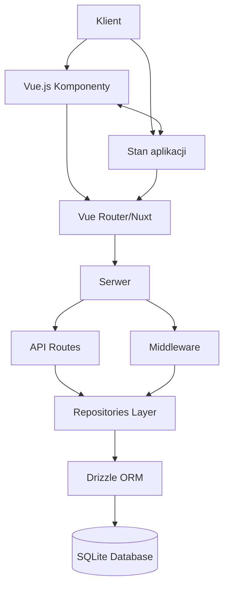

# Architektura systemu

::alert{type="info"}
ATP System to zaawansowana aplikacja pełnostackowa zbudowana na Nuxt.js 3, łącząca rendering po stronie serwera (SSR) z renderowaniem po stronie klienta.
::

## Ogólna architektura

System ATP został zbudowany w oparciu o następujące technologie:

::list{type="success"}
- **Frontend**: Vue.js 3 + Nuxt.js 3
- **Backend**: Nitro Server (zintegrowany z Nuxt.js)
- **Baza danych**: SQLite z Drizzle ORM
- **Stylowanie**: Tailwind CSS
- **Zarządzanie zawartością**: Nuxt Content
::

### Diagram architektury



## Główne komponenty systemu

::card{icon="i-heroicons-cube"}
#title
Nuxt.js Framework
#description
Nuxt.js zapewnia strukturę aplikacji, routing, middleware i integrację serwera:

- **app/** - Zawiera główny kod aplikacji
- **server/** - Kod uruchamiany na serwerze
- **public/** - Statyczne zasoby
- **content/** - Treści zarządzane przez Nuxt Content
::

::card{icon="i-heroicons-shield-check"}
#title
System uwierzytelniania i autoryzacji
#description
System wykorzystuje mechanizm JWT (JSON Web Tokens) do uwierzytelniania i przechowywania sesji użytkownika:

- **Middleware autoryzacji** (`app/middleware/auth.ts`) - sprawdza uprawnienia użytkownika
- **Middleware inicjalizacyjne** (`app/middleware/01.init.global.ts`) - inicjalizuje sesję użytkownika
- **Middleware API** (`server/middleware/check-permission.ts`) - kontroluje dostęp do endpointów API
::

::card{icon="i-heroicons-user-group"}
#title
System ról i uprawnień
#description
Wielopoziomowy system kontroli dostępu:

- **Role użytkowników** - ADMIN, MANAGER, COACH, EDITOR, ATHLETE, USER, OBSERVER
- **Granularne uprawnienia** - ponad 40 różnych uprawnień podzielonych na kategorie
- **Mapowanie uprawnień do API** - powiązanie endpointów API z wymaganymi uprawnieniami
- **Cache'owanie uprawnień** - optymalizacja wydajności przez przechowywanie uprawnień w lokalnym magazynie
::

::card{icon="i-heroicons-server"}
#title
Warstwa API
#description
Serwer Nitro obsługuje endpointy API w katalogu api:

- **Automatyczne mapowanie URL** - pliki organizowane jako `[resource]/[action].[method].ts`
- **Obsługa różnych metod HTTP** - GET, POST, PUT, DELETE itp.
- **Standardowy format odpowiedzi** - ujednolicona struktura odpowiedzi API
::

::card{icon="i-heroicons-database"}
#title
Warstwa bazy danych
#description
System używa SQLite jako bazy danych i Drizzle ORM jako warstwy abstrakcji:

- **Schema** - Definicje tabel i relacji w schema.ts
- **Repozytoria** - Enkapsulacja logiki dostępu do danych w repositories
- **Migracje** - Obsługa zmian schematu bazy danych
::

::card{icon="i-heroicons-puzzle-piece"}
#title
Komponenty UI
#description
Interfejs użytkownika jest zbudowany przy użyciu Tailwind CSS i zorganizowany w modułowe komponenty:

- **Layouts** - Układy stron (dashboard, public)
- **Components** - Wielokrotnego użytku komponenty UI
- **Pages** - Poszczególne strony aplikacji
::

## Przepływ danych

::tabs
#tab{name="Przepływ żądania HTTP" icon="i-heroicons-arrow-path"}
1. Żądanie trafia do Nuxt.js
2. Nuxt.js kieruje żądanie do odpowiedniej ścieżki (API lub strona)
3. Middleware sprawdza uwierzytelnienie i uprawnienia
4. W przypadku API:
   - Endpoint API przetwarza żądanie
   - Używa repozytoriów do operacji na bazie danych
   - Zwraca odpowiedź
5. W przypadku strony:
   - Komponenty Vue są renderowane
   - Dane są pobierane za pomocą composables
   - Strona jest zwracana do klienta

#tab{name="Przepływ autoryzacji" icon="i-heroicons-key"}
1. Użytkownik loguje się, przekazując poświadczenia
2. Serwer weryfikuje poświadczenia i generuje tokeny JWT
3. Tokeny są przechowywane w cookie lub localStorage
4. Middleware auth sprawdza tokeny dla każdego żądania
5. System uprawnień weryfikuje, czy użytkownik ma dostęp do zasobu
6. Przyznanie lub odmowa dostępu
::

## Komunikacja między komponentami

### Zarządzanie stanem

System wykorzystuje `useState` z Nuxt.js do zarządzania stanem aplikacji:

```ts
// Definicja stanu
const users = useState<UserResource[]>('users', () => [])

// Aktualizacja stanu
users.value = [...newUsers]

// Odczytanie stanu w innym komponencie
const users = useState<UserResource[]>('users')
```

### Composables

Reużywalne funkcje (composables) enkapsulują logikę biznesową i dostęp do API:

```ts
// Definicja composable
export function useUsersApi() {
  // Stan, metody, etc.
  return { /* API */ }
}

// Użycie w komponencie
const { users, fetchUsers } = useUsersApi()
```

## Optymalizacja wydajności

::callout{type="tip"}
System ATP stosuje szereg technik optymalizacji wydajności:
::

::list{type="success"}
- **Cache'owanie uprawnień użytkownika** - Uprawnienia są obliczane raz i przechowywane lokalnie
- **Lazy loading komponentów** - Komponenty są ładowane tylko wtedy, gdy są potrzebne
- **Selektywne pobieranie danych** - API pobiera tylko niezbędne dane
- **Strategie renderowania** - Wykorzystanie optymalnych strategii renderowania dla różnych stron
::

## Środowiska

System obsługuje różne środowiska zdefiniowane w plikach .env:

::code-group
```bash [.env.development]
NODE_ENV=development
API_BASE_URL=http://localhost:3000
DEBUG=true
```

```bash [.env.staging]
NODE_ENV=staging
API_BASE_URL=https://staging.atp-system.pl
DEBUG=false
```

```bash [.env.production]
NODE_ENV=production 
API_BASE_URL=https://atp-system.pl
DEBUG=false
```
::

## Rozszerzalność

::alert{type="success"}
Architektura systemu została zaprojektowana z myślą o rozszerzalności!
::

1. **Modułowa struktura** - Łatwe dodawanie nowych funkcji
2. **System uprawnień** - Proste dodawanie nowych uprawnień
3. **Abstrakcja bazy danych** - Możliwość zmiany silnika bazy danych
4. **Konfigurowalność** - Elastyczne opcje konfiguracji