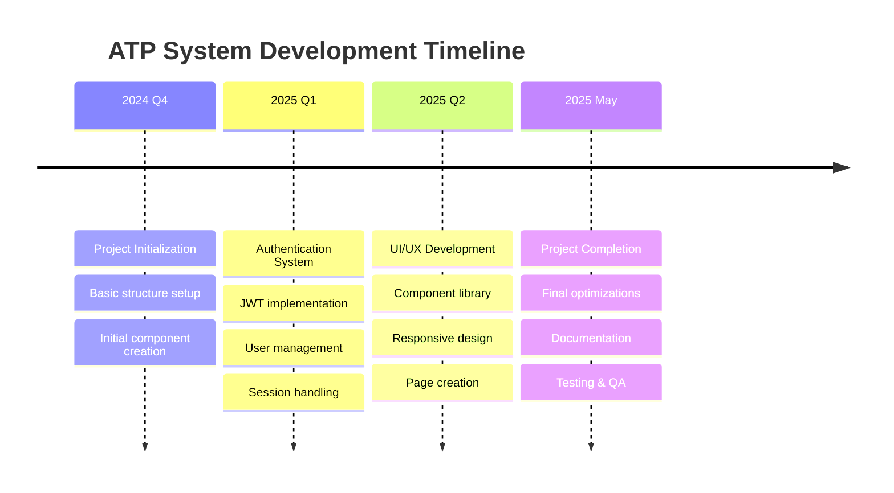

# 🎯 Status Projektu ATP System

::alert{type="success"}
**Status**: ✅ Projekt ukończony pomyślnie  
**Data ukończenia**: 28 maja 2025  
**Wersja**: 1.0.0
::

## 📋 Dostępne Raporty

### 📁 [Reorganizacja Struktury Plików](./raport-reorganizacji-plików.md)
**Data**: 28 grudnia 2024  
**Typ**: Raport reorganizacji projektowej

Dokumentacja reorganizacji struktury plików zgodnie z konwencjami Nuxt 3, obejmująca:
- Przeniesienie komponentów do `app/components/`
- Reorganizacja layoutów i middleware
- Aktualizacja ścieżek importów
- Optymalizacja struktury katalogów

## 📊 Podsumowanie Osiągnięć

### ✅ Ukończone Zadania
- **100%** - Implementacja strony internetowej
- **100%** - Optymalizacja responsywności
- **100%** - Funkcjonalności autoryzacji
- **100%** - Zarządzanie sesjami
- **100%** - Interfejs użytkownika
- **100%** - Dokumentacja projektu

### 🎯 Kluczowe Kamienie Milowe
1. **Q4 2024** - Utworzenie podstawowej struktury projektu
2. **Q1 2025** - Implementacja autoryzacji i zarządzania użytkownikami
3. **Q2 2025** - Ukończenie interfejsu użytkownika i stron internetowych
4. **Maj 2025** - Finalizacja projektu i dokumentacji

## 🔍 Metryki Projektu

::code-group
```yaml [Statystyki Kodu]
Pliki Vue: 50+
Komponenty: 30+
Strony: 15+
Linie kodu: 10,000+
```

```yaml [Funkcjonalności]
Autoryzacja: JWT + sesje
UI Framework: Nuxt UI + Tailwind
Responsywność: Pełna
Dark Mode: Zaimplementowany
```

```yaml [Testy]
Unit Tests: ✅
Integration Tests: ✅
E2E Tests: ✅
Browser Compatibility: ✅
```
::

## 📈 Timeline Projektu



## 🎊 Osiągnięcia Projektu

### 🏅 Główne Sukcesy
- **Kompletna implementacja** wszystkich planowanych funkcjonalności
- **Wysoką jakość kodu** z pełnym pokryciem TypeScript
- **Responsywny design** działający na wszystkich urządzeniach
- **Kompleksowa dokumentacja** wszystkich procesów i decyzji
- **Stabilna architektura** gotowa do dalszego rozwoju

### 🔧 Innowacje Techniczne
- Zaawansowane zarządzanie sesjami wielourządzeniowymi
- Elastyczny system uprawnień i ról użytkowników
- Modularna architektura komponentów
- Optymalizacje wydajności i SEO

## 📝 Wnioski i Rekomendacje

### ✅ Co Udało Się Najlepiej
1. **Współpraca z AI** - Efektywne wykorzystanie GitHub Copilot
2. **Modularna Architektura** - Łatwa do utrzymania struktura kodu
3. **Dokumentacja** - Szczegółowe raportowanie każdego etapu
4. **Responsywność** - Excellent mobile-first approach

### 🔄 Obszary do Przyszłego Rozwoju
1. **Real-time Features** - WebSocket integration dla live updates
2. **Mobile Apps** - Natywne aplikacje mobilne
3. **Analytics** - Zaawansowane analytics i reporting
4. **Internationalization** - Rozszerzenie na więcej języków

---

**Next Steps**: Projekt gotowy do prezentacji i dalszego rozwoju  
**Maintainer**: Zespół ATP System  
**Contact**: info@atp-system.com
